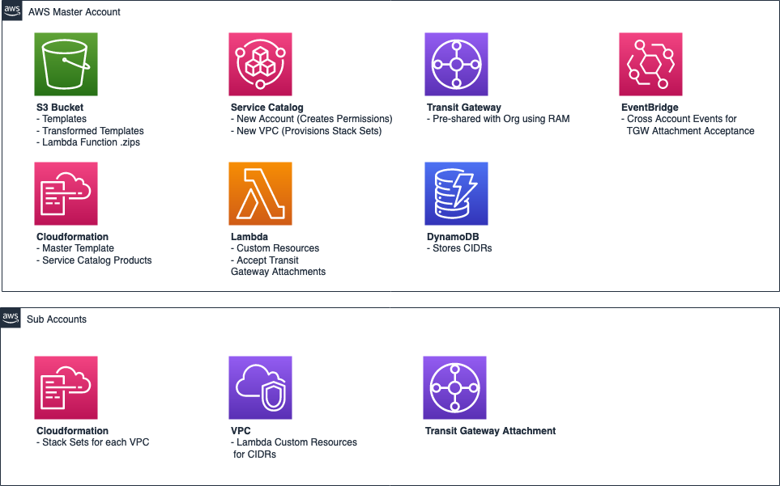
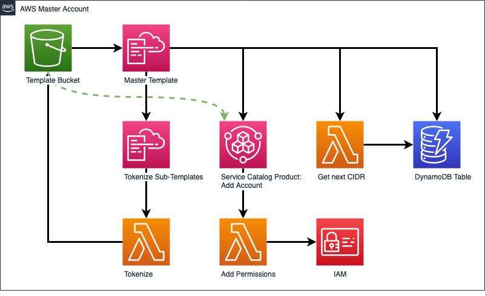
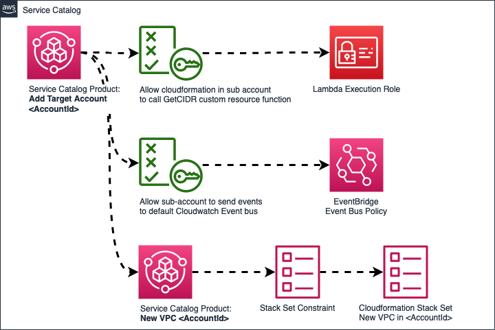
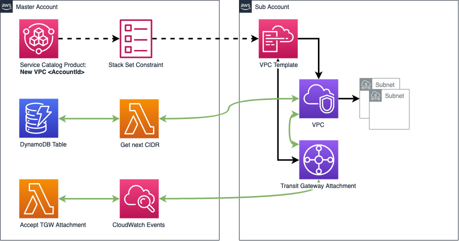

# Network Provisioner

## Description

This template was developed to accomplish the following:

    1. Provision VPCs in AWS Control Tower sub-accounts from a common address pool
    2. Automatically provision Transit Gateway Attachments to these VPCs
    3. Automatically Accept these attachments (even if the Transit gateway is not configured to automatically accept)

## Requirements

    1. A multi-account organization with pre-existing cross-account roles -- This template has been designed for AWS Control Tower, but this can work with custom stack-set execution roles as well.
    2. A transit gateway which is shared with all necessary sub-accounts using Resource Access Manager
    3. An S3 bucket to store the templates used by and generated by this project

## Overview

### Services Overview

This is a serverless solution for provisioning CIDRs from a common address pool. When you install the solution, you'll select a master address pool (ie. 10.0.0.0/16) and then sizes for both VPC and Subnet CIDRs (ie. /22, /24, /26, etc)

Once provisioned, you will be able to provision VPCs in sub-accounts using Service Catalog. You can also share this service catalog portfolio with another account to assign to a networking or operations team.

### Master Template

### Add Account Product

### New VPC Product

## Installation

1. Clone this repo
2. run build.py, note the output folder.
3. sync or upload the contents of the output folder to an S3 bucket
> Note: The CloudFormation execution role used in the Master Account needs access to read and write templates to this bucket.

## Workflow