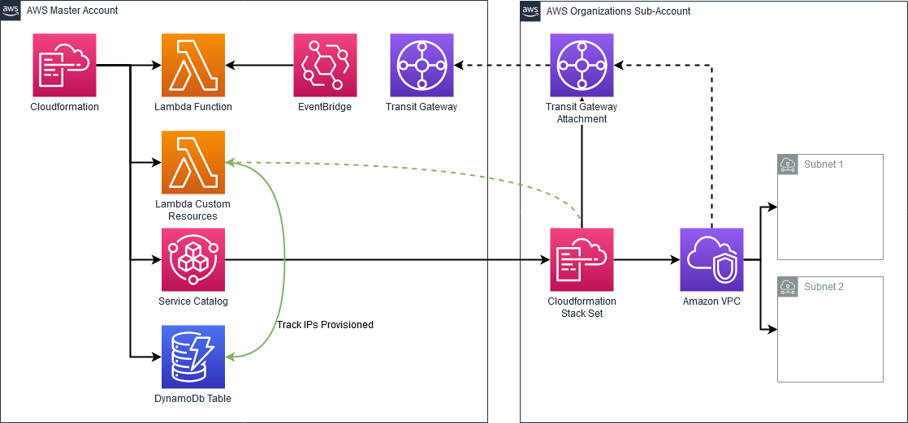

# Network Provisioner

### Disclaimer

This solution is offered as-is. Developer offers no warranties, express or implied. 

## Description

This template was developed to accomplish the following:

    1. Provision VPCs in AWS Control Tower sub-accounts from a common address pool
    2. Automatically provision Transit Gateway Attachments to these VPCs
    3. Automatically Accept these attachments (even if the Transit gateway is not configured to automatically accept)

## Requirements

    1. A transit gateway which is shared with all necessary sub-accounts using Resource Access Manager
    2. An S3 bucket to store the templates used by this project

## Diagram

## Installation

1. run build.py
2. sync or upload the contents of the output folder to an S3 bucket
    The master account needs access to provision and upload templates to this bucket.
3. 

## Workflow